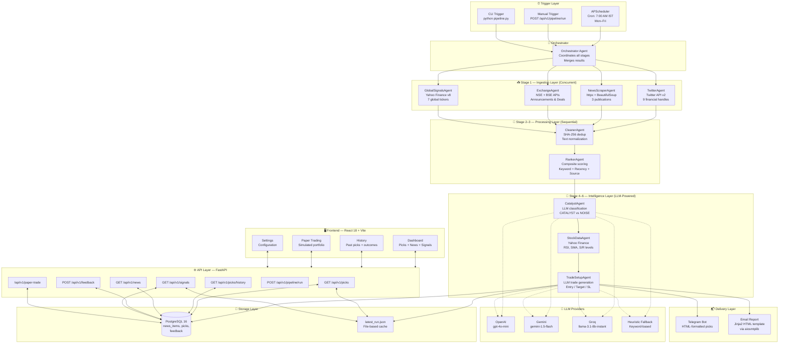
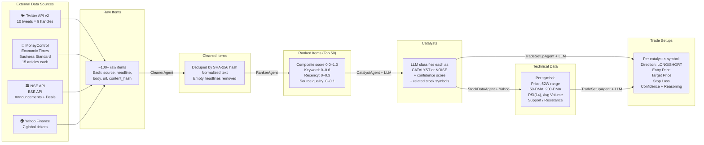
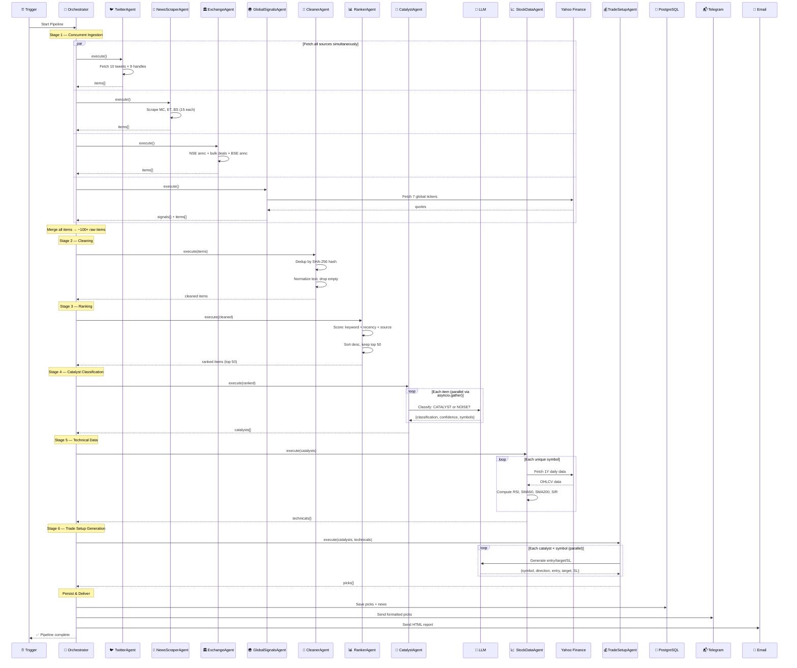
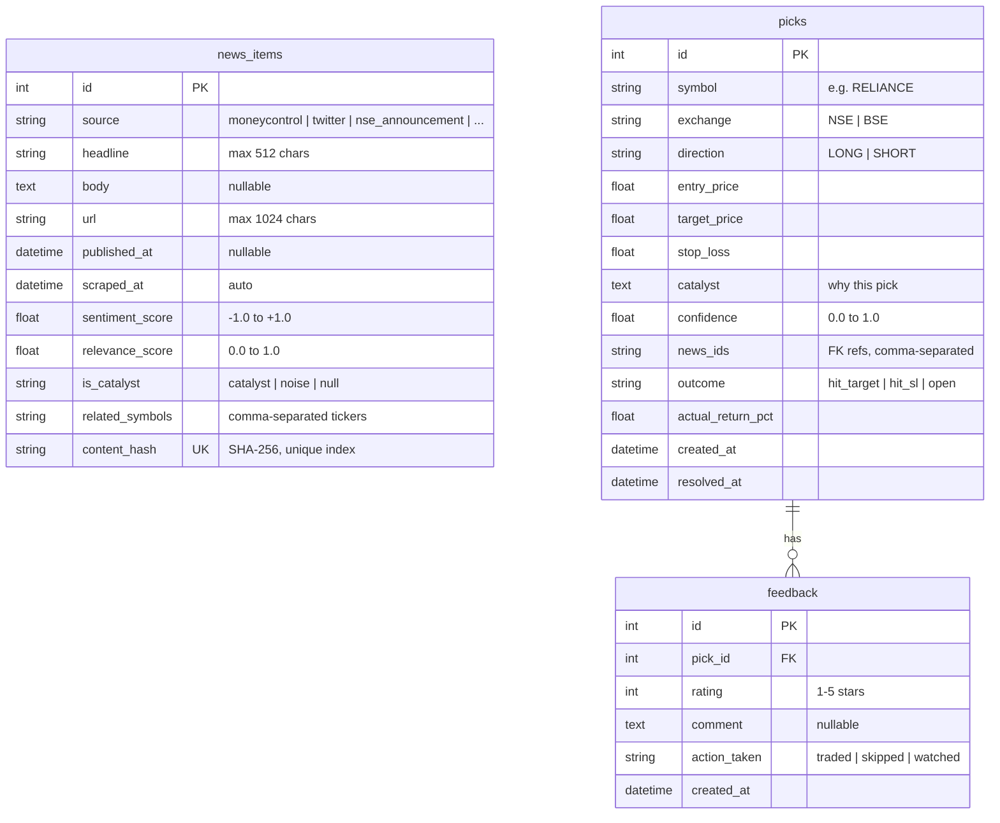
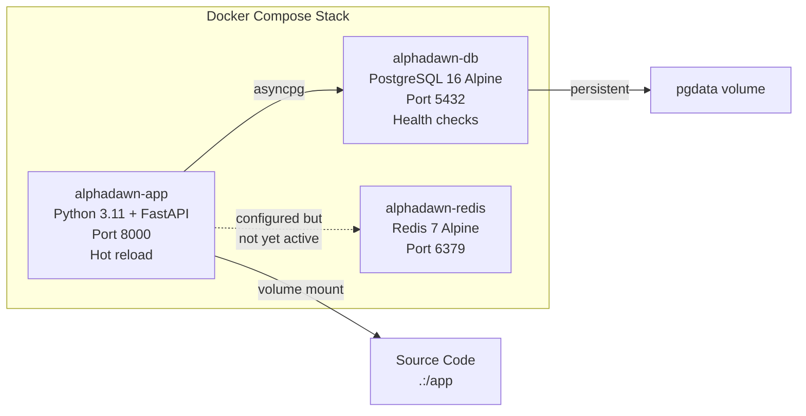

# AlphaDawn — Complete Project Documentation

**AlphaDawn** is an AI-powered pre-market intelligence platform for Indian stock markets. It runs a multi-agent pipeline every morning before market open — scraping financial news, exchange announcements, and global signals — then uses LLMs to classify catalysts and generate actionable trade setups with entry, target, and stop-loss levels. Results are served via a FastAPI backend and displayed on a React dashboard, with optional delivery via Telegram and Email.

---

## 1. System Architecture



---

## 2. Data Flow Diagram

Shows the transformation of data from raw sources to final trade recommendations:



---

## 3. Pipeline Process Diagram

Step-by-step execution flow of a single pipeline run:



---

## 4. Directory Structure

```
AlphaDawn/
├── app/
│   ├── agents/
│   │   ├── base_agent.py              # Abstract base — timing, logging, error handling
│   │   ├── orchestrator.py            # Master pipeline coordinator (6 stages)
│   │   ├── ingestion/
│   │   │   ├── twitter_agent.py       # Twitter API v2 — 9 curated handles
│   │   │   ├── news_scraper_agent.py  # MC, ET, BS headline scraper
│   │   │   ├── exchange_agent.py      # NSE/BSE announcements & bulk deals
│   │   │   └── global_signals_agent.py # Dow, S&P500, Crude, Gold, USD/INR, US10Y
│   │   ├── processing/
│   │   │   ├── cleaner_agent.py       # SHA-256 dedup + text normalization
│   │   │   └── ranker_agent.py        # Composite relevance scoring → top 50
│   │   └── intelligence/
│   │       ├── catalyst_agent.py      # LLM classifier (CATALYST / NOISE)
│   │       ├── stock_data_agent.py    # Yahoo Finance technicals (RSI, SMA, S/R)
│   │       └── trade_setup_agent.py   # LLM trade generator (entry/target/SL)
│   ├── api/
│   │   ├── dependencies.py            # FastAPI DI — settings, DB session
│   │   └── routes/
│   │       ├── picks.py               # GET /picks, /picks/history
│   │       ├── news.py                # GET /news feed
│   │       ├── feedback.py            # POST /feedback
│   │       ├── signals.py             # GET /signals
│   │       ├── pipeline.py            # POST /pipeline/run (synchronous)
│   │       └── paper_trade.py         # Paper trading endpoints
│   ├── delivery/
│   │   ├── telegram_bot.py            # HTML-formatted Telegram messages
│   │   └── email_report.py            # Jinja2 HTML email via aiosmtplib
│   ├── models/
│   │   ├── news.py                    # NewsItem ORM (SQLAlchemy)
│   │   ├── pick.py                    # Pick ORM with outcome tracking
│   │   └── feedback.py                # Feedback ORM (rating + action)
│   ├── schemas/
│   │   ├── agent.py                   # AgentResult — uniform agent envelope
│   │   ├── pick.py                    # PickCreate, PickResponse, PickListResponse
│   │   └── news.py                    # NewsCreate, NewsResponse, NewsFeedResponse
│   ├── prompts/
│   │   ├── catalyst_classifier.txt    # LLM prompt — CATALYST vs NOISE rules
│   │   └── trade_setup.txt            # LLM prompt — swing-trade setup rules
│   ├── config.py                      # Pydantic Settings (env-driven)
│   ├── scheduler.py                   # APScheduler cron job (7 AM IST)
│   └── main.py                        # FastAPI app + CORS + route registration
├── frontend/
│   └── src/
│       ├── App.jsx                    # Router + sidebar navigation
│       ├── pages/
│       │   ├── Dashboard.jsx          # Main view — picks, news, signals
│       │   ├── History.jsx            # Historical picks + outcomes
│       │   ├── PaperTrading.jsx       # Simulated portfolio tracking
│       │   └── Settings.jsx           # App configuration
│       └── components/
│           ├── PickCard.jsx           # Trade pick display card
│           ├── NewsFeed.jsx           # Scrollable news list
│           ├── GlobalSignals.jsx      # Macro indicator panel
│           ├── AgentStatus.jsx        # Pipeline agent status display
│           └── PnLTracker.jsx         # Profit & loss tracking chart
├── pipeline.py                        # CLI entry point for manual runs
├── docker-compose.yml                 # App + PostgreSQL 16 + Redis 7
├── Dockerfile                         # Python app container
└── requirements.txt                   # All Python dependencies
```

---

## 5. Database Schema



---

## 6. Agent Deep-Dive

### 6.1 BaseAgent (Abstract)
All agents inherit from `BaseAgent`. It provides:
- **Uniform execution**: `execute()` wraps the agent's `run()` method
- **Timing**: Measures execution time via `time.perf_counter()`
- **Error handling**: Catches exceptions and returns a failed `AgentResult`
- **Logging**: Start/finish logs with emoji status and duration

Every agent returns an `AgentResult` — a Pydantic model with fields: `agent_name`, `success`, `data`, `error`, `duration_ms`, `timestamp`.

---

### 6.2 Ingestion Agents (Stage 1 — Run Concurrently)

| Agent | Source | Method | Output |
|-------|--------|--------|--------|
| **TwitterAgent** | Twitter API v2 | Resolves 9 handles → user IDs, fetches 10 recent tweets each | `items[]` with tweet text, URL, timestamp, SHA-256 hash |
| **NewsScraperAgent** | MoneyControl, Economic Times, Business Standard | HTTP GET + BeautifulSoup CSS selectors, 15 headlines per source | `items[]` with headline, article URL, source name, SHA-256 hash |
| **ExchangeAgent** | NSE India API, BSE India API | JSON API calls (corporate announcements, block/bulk deals). Handles NSE session cookies | `items[]` with announcement text, deal details, attachment URLs |
| **GlobalSignalsAgent** | Yahoo Finance v8 chart API | Fetches 7 tickers: SGX Nifty proxy, Dow Futures, S&P500 Futures, Crude Oil, Gold, USD/INR, US 10Y yield | `signals{}` with price, previous close, change %, and a summary headline |

---

### 6.3 Processing Agents (Stages 2–3 — Sequential)

**CleanerAgent (Stage 2)**
1. Iterates through all merged raw items
2. **Deduplicates** using a `set()` of SHA-256 content hashes — O(1) lookups
3. **Normalizes** text: strips whitespace, collapses multiple spaces, removes control characters via regex
4. **Drops** items with empty headlines after normalization

**RankerAgent (Stage 3)**
Computes a composite score (0.0 – 1.0) with three weighted components:

| Component | Weight | Logic |
|-----------|--------|-------|
| **Keyword relevance** | 0 – 0.6 | Matches against 25+ financial keywords (bonus, split, buyback, SEBI, RBI, earnings, etc.) at +0.15 per hit, capped at 0.6 |
| **Recency boost** | 0 – 0.3 | <2h → 0.30, <6h → 0.20, <12h → 0.10, older → 0.05 |
| **Source quality** | 0 – 0.1 | NSE/BSE → 0.10, MoneyControl/ET → 0.07, Twitter → 0.04 |

Sorts descending and **keeps only the top 50 most relevant items**.

---

### 6.4 Intelligence Agents (Stages 4–6 — LLM-Powered)

**CatalystAgent (Stage 4)**
- Classifies each of the top 50 items as **CATALYST** or **NOISE**
- Runs all classifications **in parallel** via `asyncio.gather`
- Uses a structured prompt ([catalyst_classifier.txt](file:///Users/yashpaliwal/Desktop/AlphaDawn/app/prompts/catalyst_classifier.txt)) that defines catalyst rules (corporate actions, earnings surprises, regulatory changes, etc.)
- LLM priority chain: OpenAI → Gemini → Groq → keyword heuristic fallback
- Enriches each item with: `is_catalyst`, `catalyst_confidence` (0.0–1.0), `related_symbols`

**StockDataAgent (Stage 5)**
- Extracts unique stock symbols from all catalysts' `related_symbols`
- Maps special names (NIFTY → `^NSEI`) and appends `.NS` for NSE stocks
- Fetches 1-year daily OHLCV data from Yahoo Finance v8 API
- Computes per symbol:
  - **Current price**, **previous close**, **52-week high/low**
  - **50-day SMA**, **200-day SMA** (golden/death cross detection)
  - **RSI(14)** — relative strength index
  - **20-day average volume**
  - **Support/Resistance** levels (2% bands around current price)

**TradeSetupAgent (Stage 6)**
- For each *catalyst × symbol* pair, builds a prompt combining the news headline + full technical data
- Uses a structured prompt ([trade_setup.txt](file:///Users/yashpaliwal/Desktop/AlphaDawn/app/prompts/trade_setup.txt)) enforcing ≥2:1 risk-reward, breakout rules, trend awareness
- LLM generates: `symbol, direction (LONG/SHORT), entry_price, target_price, stop_loss, confidence, reasoning`
- **Heuristic fallback** (no LLM): 3% stop-loss, 6% target (2:1 RR), LONG if price > 50-DMA else SHORT
- All setups run **in parallel** via `asyncio.gather`

---

## 7. API Endpoints

| Method | Endpoint | Description |
|--------|----------|-------------|
| `GET` | `/api/v1/picks` | Today's trade pick recommendations |
| `GET` | `/api/v1/picks/history` | Historical picks with outcomes (hit_target / hit_sl / open) |
| `GET` | `/api/v1/news` | Curated, ranked news feed |
| `POST` | `/api/v1/feedback` | Submit user feedback on a pick (1–5 stars + action) |
| `GET` | `/api/v1/signals` | Global market indicators (Dow, S&P, Crude, Gold, etc.) |
| `POST` | `/api/v1/pipeline/run` | Trigger full pipeline synchronously (blocks until complete) |
| `*` | `/api/v1/paper-trade` | Paper trading / simulated portfolio endpoints |
| `GET` | `/health` | Health check endpoint |

---

## 8. Delivery Channels

**Telegram Bot**
- Formats picks as HTML with emojis (🟢 LONG / 🔴 SHORT)
- Includes: symbol, direction, entry/target/SL (₹), confidence %, catalyst summary
- Sends via `python-telegram-bot` to the configured chat ID

**Email Report**
- Generates a premium dark-themed HTML email using **Jinja2** templates
- Styled with gradient headers, pick cards, direction-color coding
- Sent via **aiosmtplib** (async SMTP with TLS)
- Supports multiple comma-separated recipients

---

## 9. Infrastructure



---

## 10. Tech Stack Summary

| Layer | Technologies |
|-------|-------------|
| **Backend** | Python 3.11, FastAPI, Uvicorn, Pydantic v2, Pydantic-Settings |
| **Database** | PostgreSQL 16, SQLAlchemy 2.0 (async), Alembic, asyncpg |
| **AI / LLM** | OpenAI (gpt-4o-mini), Google Gemini (1.5-flash), Groq (llama-3.1-8b) |
| **Scraping** | httpx (async), BeautifulSoup4, lxml |
| **Market Data** | Yahoo Finance v8 API, yfinance |
| **Frontend** | React 18, Vite, React Router, Recharts |
| **Delivery** | python-telegram-bot, aiosmtplib, Jinja2 |
| **Scheduling** | APScheduler (AsyncIOScheduler, CronTrigger) |
| **Infrastructure** | Docker, Docker Compose |
| **Testing** | pytest, pytest-asyncio |
