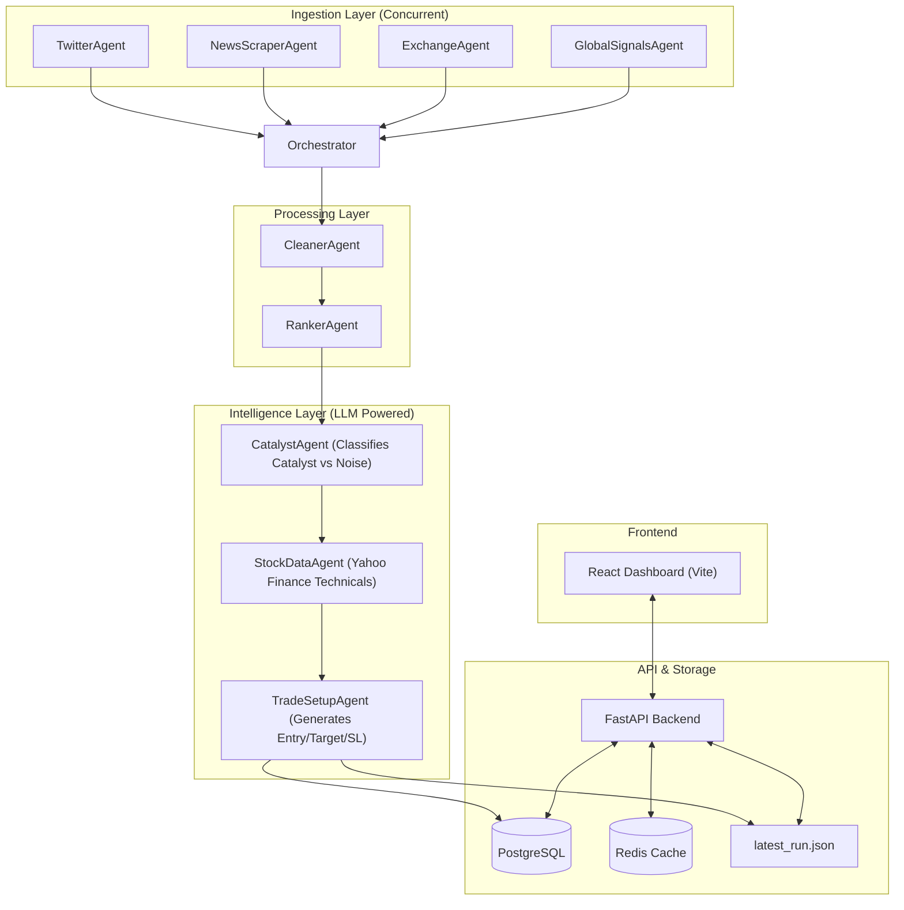

# AlphaDawn System Architecture

AlphaDawn is an AI-powered pre-market intelligence system designed for the Indian stock market. It automates the process of gathering news, identifying catalysts, and generating actionable trade setups.

## High-Level Architecture

The system follows a modular architecture with a clear separation between data ingestion, intelligent processing, and the user-facing web application.

---

## Component Breakdown

### 1. The Orchestrator
The `Orchestrator` is the master agent that coordinates the end-to-end pipeline execution. It manages the transition between stages and ensures data consistency throughout the run.

### 2. Ingestion Agents
- **TwitterAgent**: Tracks curated financial handles for real-time sentiment and news.
- **NewsScraperAgent**: Scrapes major Indian publications (Economic Times, MoneyControl, Business Standard).
- **ExchangeAgent**: Direct integration with NSE/BSE for corporate announcements and large deals.
- **GlobalSignalsAgent**: Monitors global market indicators like SGX NIFTY, Dollar Index, and US Treasury yields.

### 3. Intelligence Pipeline
The core value proposition lies in these three stages:
1. **Catalyst Identification**: Uses an LLM to distinguish "market noise" from "price action catalysts" (e.g., regulatory changes, earnings surprises, bulk deals).
2. **Technicals Fetching**: Automatically retrieves RSI, SMA (50/200), and pivot-based support/resistance levels for identified stock symbols.
3. **Trade Setup Generation**: Combines the news catalyst with technical data to suggest precise entry points, stop-losses, and profit targets.

### 4. API Layer (FastAPI)
Exposes the data through REST endpoints:
- `/api/v1/picks`: Returns the latest trade recommendations.
- `/api/v1/news`: Cleaned and ranked market news stream.
- `/api/v1/pipeline/run`: Synchronous execution of the full intelligence pipeline.
- `/api/v1/signals`: Global market macro-view.

### 5. Frontend (React)
A premium dark-mode dashboard built with Vite, providing:
- Real-time display of catalysts and trade picks.
- Global signal indicators.
- Manual pipeline trigger with full-screen loading state.

---

## Data Flow
1. **Trigger**: Pipeline starts manually (UI) or via cron (7:00 AM IST).
2. **Collect**: Ingestion agents run concurrently to minimize latency.
3. **Refine**: Cleaner/Ranker filter out duplicates and low-relevance items.
4. **Think**: CatalystAgent uses LLM for semantic understanding.
5. **Verify**: StockDataAgent adds quantitative technical context.
6. **Plan**: TradeSetupAgent generates the final recommendation.
7. **Persist**: Results are stored in the database and updated in the UI.
